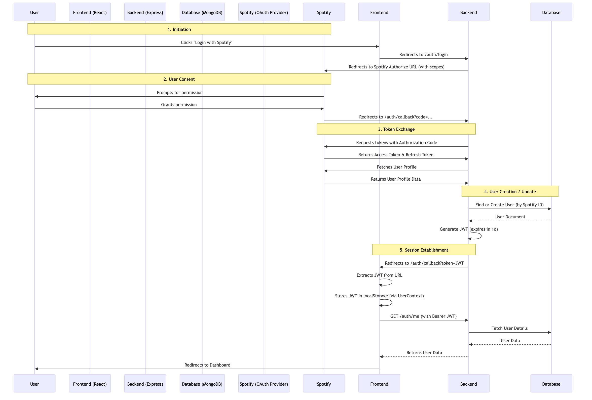

# Authentication and Login Documentation

This document outlines the authentication and login flow for the Groupify application, detailing the services, components, and interactions involved.

## Overview

Groupify uses a **Hybrid Authentication** strategy:
1.  **Spotify OAuth 2.0**: Used for initial user identity verification and to obtain permissions for Spotify API access (playback, reading data).
2.  **JWT (JSON Web Token)**: Used for maintaining the user's session with the Groupify backend after the initial Spotify login.

## Services and Components

### Backend (`Groupify-backend`)

*   **`authController.js`**: Handles the core logic for login, callback, and token management.
    *   `login`: Redirects to Spotify's authorization page.
    *   `callback`: Exchanges the authorization code for Spotify tokens, creates/updates the user in the database, and issues a JWT.
    *   `refresh`: Refreshes the Spotify access token using the stored refresh token.
    *   `getSpotifyToken`: Provides a valid Spotify access token to the frontend (for the Web Playback SDK).
*   **`authRoutes.js`**: Defines the API endpoints for authentication (`/auth/login`, `/auth/callback`, `/auth/me`, etc.).
*   **`authMiddleware.js`**: Protects routes by verifying the JWT in the `Authorization` header.
*   **`User.js` (Model)**: Stores user data, including Spotify ID, profile info, and encrypted Spotify tokens (access and refresh tokens).
*   **`SpotifyService`**: Helper service to interact with Spotify's Web API (token exchange, fetching profile).

### Frontend (`Groupify-frontend`)

*   **`UserContext.tsx`**: Manages the global authentication state (`user`, `token`, `isAuthenticated`). It handles:
    *   Initializing state from `localStorage`.
    *   Login and Logout actions.
    *   Fetching current user data.
*   **`api.ts`**: The API client that handles all HTTP requests. It automatically attaches the JWT to the `Authorization` header for authenticated requests.
*   **`LoginScreen.tsx`**: The entry point for unauthenticated users. Displays the "Login with Spotify" button.
*   **`AuthCallbackScreen.tsx`**: Handles the redirect from the backend after successful Spotify login. It extracts the JWT from the URL query parameters and logs the user in via `UserContext`.
*   **`App.tsx`**: Manages high-level routing and redirects based on authentication state (e.g., redirecting to `/login` if not authenticated).

## Authentication Flow

The following diagram illustrates the step-by-step process of a user logging in:

## Detailed Steps

1.  **Login Request**: The user initiates login. The frontend redirects the browser to `API_BASE_URL/auth/login`.
2.  **Spotify Authorization**: The backend constructs a Spotify Authorization URL including the required scopes (e.g., `user-read-email`, `streaming`, `user-modify-playback-state`) and redirects the user there.
3.  **Callback Handling**:
    *   After the user approves, Spotify redirects back to the backend's `/auth/callback` endpoint with a temporary `code`.
    *   The backend exchanges this `code` for a **Spotify Access Token** and **Spotify Refresh Token**.
    *   The backend fetches the user's profile from Spotify to identify them.
4.  **User Persistence**:
    *   The backend checks if a user with this Spotify ID exists in MongoDB.
    *   If yes, it updates their Spotify tokens and profile info.
    *   If no, it creates a new User record.
5.  **JWT Generation**: The backend generates a **JWT** signed with a secret key (`JWT_SECRET`), containing the user's MongoDB ID.
6.  **Client Handoff**: The backend redirects the browser to the frontend's `/auth/callback` route, appending the JWT as a query parameter (`?token=...`).
7.  **Client Initialization**:
    *   The `AuthCallbackScreen` component on the frontend parses the token.
    *   It calls `login(token)` in `UserContext`.
    *   The token is saved to `localStorage`.
    *   The frontend immediately fetches the full user profile using the new token.
8.  **Authenticated Requests**: All subsequent API requests from the frontend include the JWT in the `Authorization: Bearer <token>` header.

## Token Refresh Strategy

*   **JWT**: The JWT is valid for 1 day. When it expires, the user is logged out and must sign in with Spotify again.
*   **Spotify Token**: Spotify access tokens expire after 1 hour.
    *   The backend stores the **Spotify Refresh Token**.
    *   When the frontend needs a valid Spotify token (e.g., for the Web Playback SDK), it calls `/auth/spotify-token`.
    *   The backend checks if the stored access token is expired. If so, it uses the refresh token to get a new one from Spotify, updates the database, and returns the valid token.
